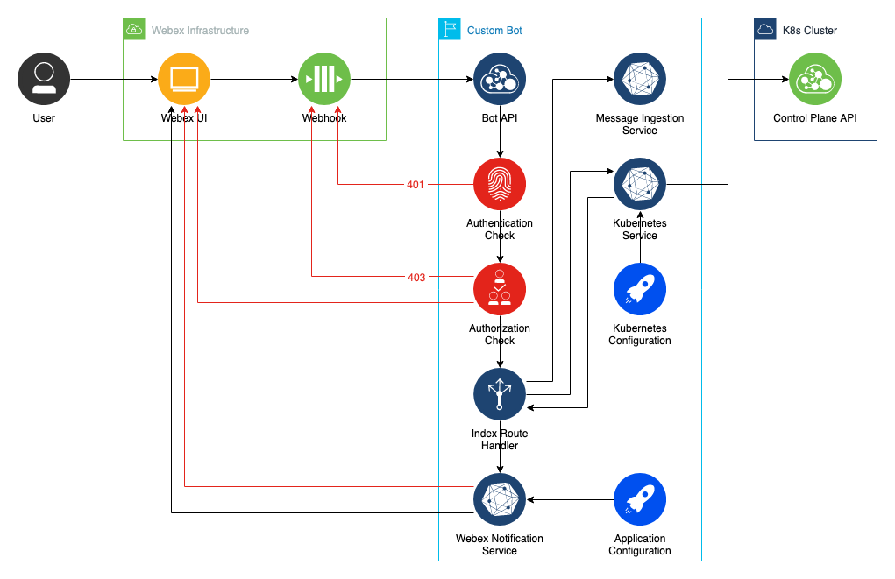

# ChatOps: Managing Kubernetes Deployments in Webex

The code in this repo corresponds to the post [found here]().  You can use it as a reference as you follow along, or as a starting point for building your own functionality.

## Architecture

## To Run Locally:
- Clone this repo
- Navigate into the cloned directory in your command line
- Install dependencies: `$ npm i` or `$ yarn`
- Run the application: `$ npm start` or `$yarn start`
